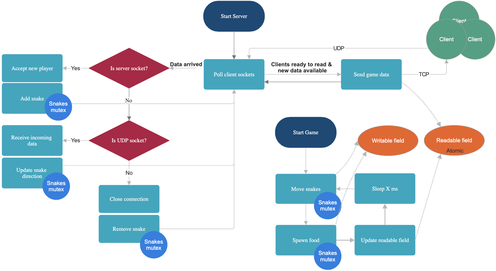

# A modern multiplayer snake game built in C++ with real-time networking capabilities.

## How to play (compatible with macOS and Linux)?

`./start.sh`

## Architecture

Client-server architecture where multiple players can compete in the same game field simultaneously

## Features

- 3 dynamic graphic libraries that can be changed on runtime
- Support for multiple concurrent players
- Real-time synchronization across all clients
- TCP server for reliable client connections
- UDP support for low-latency game updates
- Efficient serialization
- Concurrent server and game loop with proper synchronization

## Materials

1. https://www.cs.dartmouth.edu/~campbell/cs50/socketprogramming
