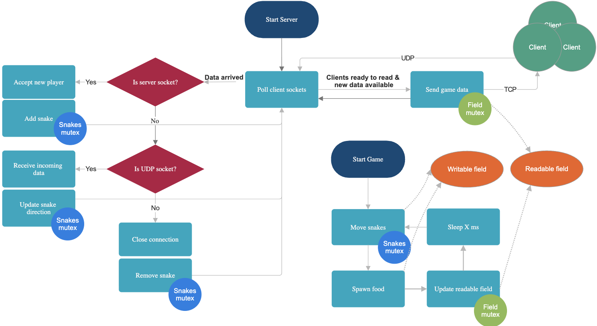
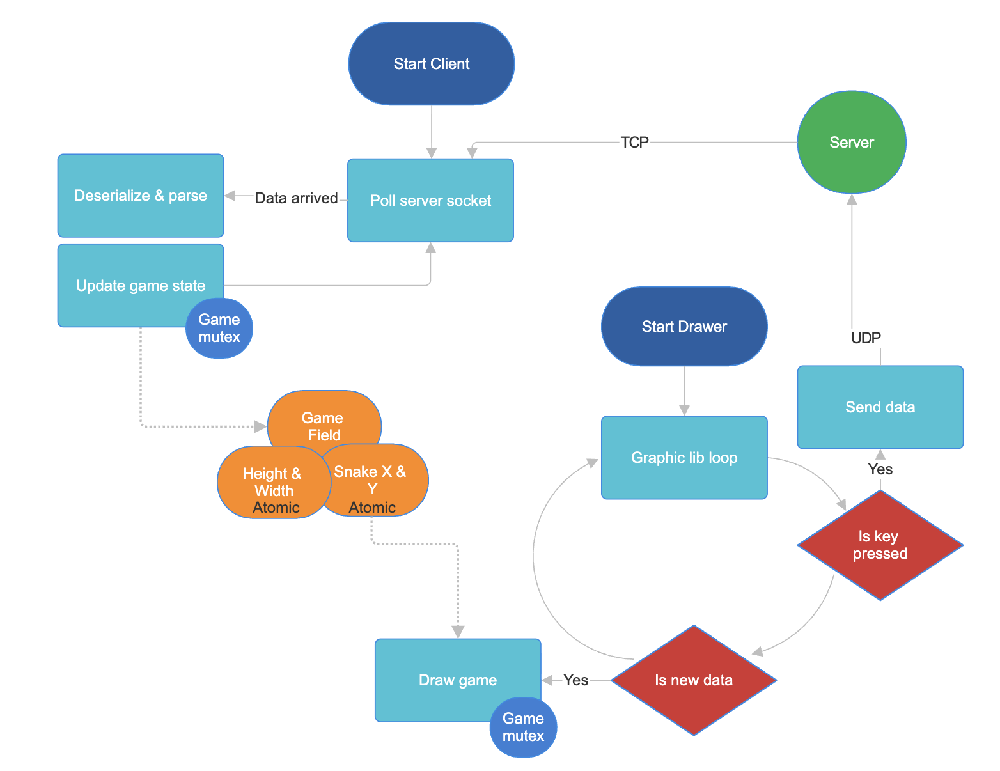

fo# A multiplayer snake game built in C++ with real-time networking capabilities.

## How to play (compatible with macOS and Linux)?

`make`

## Client-server architecture
Server

Client

## Features

- Runtime Dynamic Graphics Library Switching (`RAYLIB`, `SFML`and `SDL3`)
- Dual-Protocol Network Stack (`TCP` for client auth and game state, `UDP` for low-latency position updates)
- Non-blocking network operations with `poll`
- Multi-Threaded Game Loop (Separated server and game logic)
- `macOS` and `Linux` supported

## Materials

1. https://www.cs.dartmouth.edu/~campbell/cs50/socketprogramming
